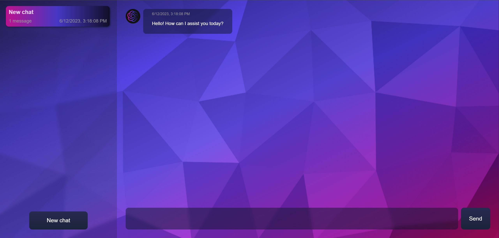
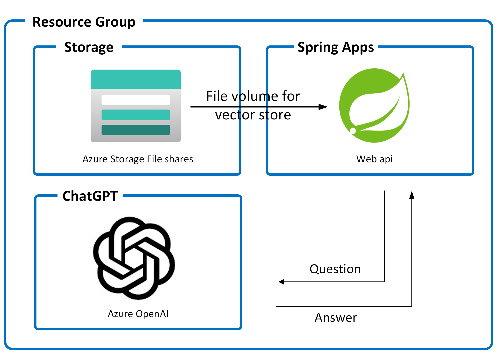

# Spring ChatGPT Sample

This sample shows how to build a ChatGPT like application in Spring and run on Azure Spring Apps.
It enables ChatGPT to use your private data to answer the questions.


## How it works


1. Query flow (Web API)
   1. Convert the user's query text to an embedding.
   1. Query Top-K nearest text chunks from the vector store (by cosine similarity).
   1. Populate the prompt template with the chunks.
   1. Call to OpenAI text completion API.
1. Indexing flow (CLI)
   1. Load the documents from the local disk / Azure storage.
   1. Split the text into chunks.
   1. Convert text chunks into embeddings
   1. Save the embeddings into Vector Store


## Run with Azure Developer CLI (AZD)
You can provision Azure resources and run this application on Azure with Azure Developer CLI (AZD), which can help you build and run your application in the cloud quickly without running multiple az cli commands step by step. For more information, see [Azure Developer CLI](https://learn.microsoft.com/en-us/azure/developer/azure-developer-cli/overview).

Let's jump in and get this up and running in Azure. When you are finished, you will have a fully functional chatgpt app deployed to the cloud. In later steps, you'll see how to setup a pipeline and run the application.



<sup>Screenshot of the deployed chatgpt app</sup>

### Prerequisites

The following prerequisites are required to use this application. Please ensure that you have them all installed locally.

- [Azure Developer CLI 1.2.0 or later](https://aka.ms/azd-install)
- [Java 17 or later](https://learn.microsoft.com/java/openjdk/install)
- [Azure CLI](https://learn.microsoft.com/cli/azure/install-azure-cli)
- An Azure subscription with access granted to Azure OpenAI (see more [here](https://customervoice.microsoft.com/Pages/ResponsePage.aspx?id=v4j5cvGGr0GRqy180BHbR7en2Ais5pxKtso_Pz4b1_xUOFA5Qk1UWDRBMjg0WFhPMkIzTzhKQ1dWNyQlQCN0PWcu))
- [Powershell 7](https://learn.microsoft.com/powershell/scripting/install/installing-powershell-on-windows?view=powershell-7.3) if you use windows

If you are using Azure Developer CLI with the version lower than 1.2.0, then you will need to enable the feature for Azure Spring Apps support manually by the following command:
```bash
azd config set alpha.springapp on
```

### Quickstart

To learn how to get started with any template, follow the steps in [this quickstart](https://learn.microsoft.com/azure/developer/azure-developer-cli/get-started?tabs=localinstall&pivots=programming-language-java) with this template(`Azure-Samples/spring-chatgpt-sample`).

This quickstart will show you how to authenticate on Azure, initialize using a template, provision infrastructure and deploy code on Azure via the following commands:

```bash
# Log in to azd. Only required once per-install.
azd auth login

# First-time project setup. Initialize a project in the current directory, using this template. 
azd init --template Azure-Samples/spring-chatgpt-sample

# Provision and deploy to Azure
azd up
```

The template by default uses a pre-built documentation [vector store](https://asawikigpt.blob.core.windows.net/demo/doc_store.json) of the [public documents](https://github.com/MicrosoftDocs/azure-docs/tree/main/articles/spring-apps) of the Azure Spring Apps.

If you want to load your own documents to the vector store, you can use the following command before running `azd up`:
```shell
# under the root of the project
mvn clean package
java -jar spring-chatgpt-sample-cli/target/spring-chatgpt-sample-cli-0.0.1-SNAPSHOT.jar --from=/<path>/<to>/<your>/<documents>
```

### Application Architecture

This application utilizes the following Azure resources:

- [**Azure Spring Apps**](https://docs.microsoft.com/azure/spring-apps/) to host the application
- [**Azure OpenAI**](https://docs.microsoft.com/azure/cognitive-services/openai/) for ChatGPT
- [**Azure Storage**](https://docs.microsoft.com/azure/storage/) as the ASA file volume for the vector store to achieve persistent storage

Here's a high level architecture diagram that illustrates these components. Notice that these are all contained within a single [resource group](https://docs.microsoft.com/azure/azure-resource-manager/management/manage-resource-groups-portal), that will be created for you when you create the resources.



> This template provisions resources to an Azure subscription that you will select upon provisioning them. Please refer to the [Pricing calculator for Microsoft Azure](https://azure.microsoft.com/pricing/calculator/) and, if needed, update the included Azure resource definitions found in `infra/main.bicep` to suit your needs.

### Application Code

This template is structured to follow the [Azure Developer CLI](https://aka.ms/azure-dev/overview). You can learn more about `azd` architecture in [the official documentation](https://learn.microsoft.com/azure/developer/azure-developer-cli/make-azd-compatible?pivots=azd-create#understand-the-azd-architecture).

### Next Steps

At this point, you have a complete application deployed on Azure. But there is much more that the Azure Developer CLI can do. These next steps will introduce you to additional commands that will make creating applications on Azure much easier. Using the Azure Developer CLI, you can delete the resources easily.

- [`azd down`](https://learn.microsoft.com/azure/developer/azure-developer-cli/reference#azd-down) - to delete all the Azure resources created with this template


### Additional `azd` commands

The Azure Developer CLI includes many other commands to help with your Azure development experience. You can view these commands at the terminal by running `azd help`. You can also view the full list of commands on our [Azure Developer CLI command](https://aka.ms/azure-dev/ref) page.


## Run with Azure CLI
**As an alternative to AZD**, you can run this sample app using the Azure CLI by following these steps. 

### Prerequisites

- JDK 17
- Maven
- Azure CLI
- An Azure subscription with access granted to Azure OpenAI (see more [here](https://aka.ms/oai/access))

### Prepare Azure Spring Apps instance

1. Use the following commands to define variables for this quickstart with the names of your resources and desired settings:

   ```bash
   LOCATION="eastus"
   RESOURCE_GROUP="<resource-group-name>"
   MANAGED_ENVIRONMENT="<Azure-Container-Apps-environment-name>"
   SERVICE_NAME="<Azure-Spring-Apps-instance-name>"
   APP_NAME="<Spring-app-name>"
   OPENAI_RESOURCE_NAME="<Azure-OpenAI-resource-name>"
   ```

1. Use the following command to create a resource group:

   ```bash
   az group create \
       --resource-group ${RESOURCE_GROUP} \
       --location ${LOCATION}
   ```

1. An Azure Container Apps environment creates a secure boundary around a group of applications. Apps deployed to the same environment are deployed in the same virtual network and write logs to the same log analytics workspace. For more information, see [Log Analytics workspace overview](../azure-monitor/logs/log-analytics-workspace-overview.md). Use the following command to create the environment:

   ```bash
   az containerapp env create \
       --resource-group ${RESOURCE_GROUP} \
       --name ${MANAGED_ENVIRONMENT} \
       --location ${LOCATION} \
       --enable-workload-profiles
   ```

1. Use the following command to create a variable to store the environment resource ID:

   ```bash
   MANAGED_ENV_RESOURCE_ID=$(az containerapp env show \
       --resource-group ${RESOURCE_GROUP} \
       --name ${MANAGED_ENVIRONMENT} \
       --query id \
       --output tsv)
   ```

1. Use the following command to create an Azure Spring Apps service instance. An instance of the Azure Spring Apps Standard consumption and dedicated plan is built on top of the Azure Container Apps environment. Create your Azure Spring Apps instance by specifying the resource ID of the environment you created.

   ```bash
   az spring create \
       --resource-group ${RESOURCE_GROUP} \
       --name ${SERVICE_NAME} \
       --managed-environment ${MANAGED_ENV_RESOURCE_ID} \
       --sku standardGen2 \
       --location ${LOCATION}
   ```

### Prepare Azure OpenAI Service

1. Run the following command to create an Azure OpenAI resource in the the resource group.

   ```bash
   az cognitiveservices account create \
      -n ${OPENAI_RESOURCE_NAME} \
      -g ${RESOURCE_GROUP} \
      -l ${LOCATION} \
      --kind OpenAI \
      --sku s0 \
      --custom-domain ${OPENAI_RESOURCE_NAME}   
   ```

1. Create the model deployments for `text-embedding-ada-002` and `gpt-35-turbo` in your Azure OpenAI service.
   ```bash
   az cognitiveservices account deployment create \
      -g ${RESOURCE_GROUP} \
      -n ${OPENAI_RESOURCE_NAME} \
      --deployment-name text-embedding-ada-002 \
      --model-name text-embedding-ada-002 \
      --model-version "2"  \
      --model-format OpenAI

   az cognitiveservices account deployment create \
      -g ${RESOURCE_GROUP} \
      -n ${OPENAI_RESOURCE_NAME} \
      --deployment-name gpt-35-turbo \
      --model-name gpt-35-turbo \
      --model-version "0301"  \
      --model-format OpenAI   
   ```

### Clone and Build the repo

1. Run `git clone https://github.com/Azure-Samples/spring-chatgpt-sample.git`
2. Run `cd spring-chatgpt-sample`.
3. Run `cp env.sh.sample env.sh` and substitute the placeholders.
4. Build with `mvn clean package`.


### Preprocess the documents

Before running the web app, you need to preprocess the documents and load them into the vector store:
```bash
source env.sh
java -jar spring-chatgpt-sample-cli/target/spring-chatgpt-sample-cli-0.0.1-SNAPSHOT.jar --from=/<path>/<to>/<your>/<documents>
```

Or [dowload](https://asawikigpt.blob.core.windows.net/demo/doc_store.json) the pre-built vector store of the [public documents](https://github.com/MicrosoftDocs/azure-docs/tree/main/articles/spring-apps) of the Azure Spring Apps.

### Run in local

To run the demo in the local machine, please follow these steps:

1. Launch the web app
   ```bash
   source env.sh
   java -jar spring-chatgpt-sample-webapi/target/spring-chatgpt-sample-webapi-0.0.1-SNAPSHOT.jar
   ```

1. Open `http://localhost:8080` in your browser.

### Run in Azure Spring Apps

1. Use the following command to specify the app name on Azure Spring Apps and to allocate required resources:

   ```bash
   az spring app create \
      --resource-group ${RESOURCE_GROUP} \
      --service ${SERVICE_NAME} \
      --name ${APP_NAME} \
      --cpu 2 \
      --memory 4Gi \
      --min-replicas 2 \
      --max-replicas 2 \
      --assign-endpoint true
   ```

1. Create a Azure storage account and a file share, then add the storage link in the Azure Container Apps environment by using the following commands. The `az containerapp env storage set` command creates a link between the environment and the file share.

   ```bash
   STORAGE_ACCOUNT_NAME="<storage-account-name>"
   FILE_SHARE_NAME="vectorstore"
   STORAGE_MOUNT_NAME="vectorstore"

   az storage account create \
      --resource-group ${RESOURCE_GROUP} \
      --name ${STORAGE_ACCOUNT_NAME} \
      --kind StorageV2 \
      --sku Standard_LRS \
      --enable-large-file-share \
      --output none   

   az storage share-rm create \
      --resource-group ${RESOURCE_GROUP} \
      --storage-account ${STORAGE_ACCOUNT_NAME} \
      --name ${FILE_SHARE_NAME} \
      --quota 1024 \
      --enabled-protocols SMB \
      --output none

   STORAGE_ACCOUNT_KEY=$(az storage account keys list \
      --resource-group ${RESOURCE_GROUP} \
      --account-name ${STORAGE_ACCOUNT_NAME} \
      --query "[0].value" \
      -o tsv)

   az containerapp env storage set \
      --resource-group ${RESOURCE_GROUP} \
      --name ${MANAGED_ENVIRONMENT} \
      --storage-name ${STORAGE_MOUNT_NAME} \
      --azure-file-account-name ${STORAGE_ACCOUNT_NAME} \
      --azure-file-account-key ${STORAGE_ACCOUNT_KEY} \
      --azure-file-share-name ${FILE_SHARE_NAME} \
      --access-mode ReadOnly
   ```

1. Add the persistent storage to the app by using the following command:

   ```bash
   az spring app append-persistent-storage \
      --resource-group ${RESOURCE_GROUP} \
      --service ${SERVICE_NAME} \
      --name ${APP_NAME} \
      --persistent-storage-type AzureFileVolume \
      --mount-path /opt/spring-chatgpt-sample \
      --storage-name ${STORAGE_MOUNT_NAME}
   ```

1. Upload the vector store file to the Azure storage account built in the previous step.

   ```bash
   az storage file upload -s ${FILE_SHARE_NAME} --account-name ${STORAGE_ACCOUNT_NAME} \
      --account-key ${STORAGE_ACCOUNT_KEY} --source ./doc_store.json
   ```

1. Use the following command to deploy the *.jar* file for the app:

   ```bash
   az spring app deploy \
      --resource-group ${RESOURCE_GROUP} \
      --service ${SERVICE_NAME} \
      --name ${APP_NAME} \
      --artifact-path spring-chatgpt-sample-webapi/target/spring-chatgpt-sample-webapi-0.0.1-SNAPSHOT.jar \
      --env AZURE_OPENAI_ENDPOINT=<your_azure_openai_endpoint> AZURE_OPENAI_APIKEY=<your_api_key> AZURE_OPENAI_CHATDEPLOYMENTID=gpt-35-turbo AZURE_OPENAI_EMBEDDINGDEPLOYMENTID=text-embedding-ada-002 VECTORSTORE_FILE=/opt/spring-chatgpt-sample/doc_store.json \
      --runtime-version Java_17
   ```


## Reporting Issues and Feedback

If you have any feature requests, issues, or areas for improvement, please [file an issue](https://aka.ms/azure-dev/issues). To keep up-to-date, ask questions, or share suggestions, join our [GitHub Discussions](https://aka.ms/azure-dev/discussions). You may also contact us via AzDevTeam@microsoft.com.