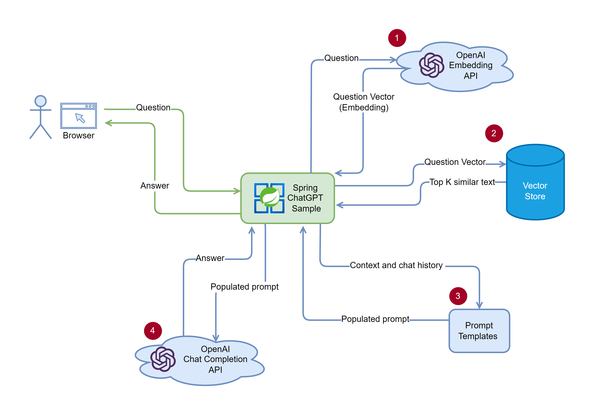

# Spring ChatGPT Sample

This sample shows how to build a ChatGPT like application in Spring and run on Azure Spring Apps.
It enables ChatGPT to use your private data to answer the questions.


## How it works



1. Query flow (Web API)
   1. Convert the user's query text to an embedding.
   1. Query Top-K nearest text chunks from the vector store (by cosine similarity).
   1. Populate the prompt template with the chunks.
   1. Call to OpenAI text completion API.
1. Indexing flow (CLI)
   1. Load the documents from the local disk / Azure storage.
   1. Split the text into chunks.
   1. Convert text chunks into embeddings
   1. Save the embeddings into Vector Store


## Getting Started

### Prerequisites

- JDK 17
- Maven
- Azure CLI

### Prepare Azure Spring Apps instance

1. Use the following commands to define variables for this quickstart with the names of your resources and desired settings:

   ```bash
   LOCATION="eastus"
   RESOURCE_GROUP="<resource-group-name>"
   MANAGED_ENVIRONMENT="<Azure-Container-Apps-environment-name>"
   SERVICE_NAME="<Azure-Spring-Apps-instance-name>"
   APP_NAME="<Spring-app-name>"
   OPENAI_RESOURCE_NAME="<Azure-OpenAI-resource-name>"
   ```

1. Use the following command to create a resource group:

   ```bash
   az group create \
       --resource-group ${RESOURCE_GROUP} \
       --location ${LOCATION}
   ```

1. An Azure Container Apps environment creates a secure boundary around a group of applications. Apps deployed to the same environment are deployed in the same virtual network and write logs to the same log analytics workspace. For more information, see [Log Analytics workspace overview](../azure-monitor/logs/log-analytics-workspace-overview.md). Use the following command to create the environment:

   ```bash
   az containerapp env create \
       --resource-group ${RESOURCE_GROUP} \
       --name ${MANAGED_ENVIRONMENT} \
       --location ${LOCATION} \
       --enable-workload-profiles
   ```

1. Use the following command to create a variable to store the environment resource ID:

   ```bash
   MANAGED_ENV_RESOURCE_ID=$(az containerapp env show \
       --resource-group ${RESOURCE_GROUP} \
       --name ${MANAGED_ENVIRONMENT} \
       --query id \
       --output tsv)
   ```

1. Use the following command to create an Azure Spring Apps service instance. An instance of the Azure Spring Apps Standard consumption and dedicated plan is built on top of the Azure Container Apps environment. Create your Azure Spring Apps instance by specifying the resource ID of the environment you created.

   ```bash
   az spring create \
       --resource-group ${RESOURCE_GROUP} \
       --name ${SERVICE_NAME} \
       --managed-environment ${MANAGED_ENV_RESOURCE_ID} \
       --sku standardGen2 \
       --location ${LOCATION}
   ```

### Prepare Azure OpenAI Service

1. Run the following command to create an Azure OpenAI resource in the the resource group.

   ```bash
   az cognitiveservices account create \
      -n ${OPENAI_RESOURCE_NAME} \
      -g ${RESOURCE_GROUP} \
      -l ${LOCATION} \
      --kind OpenAI \
      --sku s0 \
   ```

1. Create the model deployments for `text-embedding-ada-002` and `gpt-35-turbo` in your Azure OpenAI service.
   ```bash
   az cognitiveservices account deployment create \
      -g ${RESOURCE_GROUP} \
      -n ${OPENAI_RESOURCE_NAME} \
      --deployment-name text-embedding-ada-002 \
      --model-name text-embedding-ada-002 \
      --model-version "2"  \
      --model-format OpenAI \
      --scale-settings-scale-type "Standard"

    az cognitiveservices account deployment create \
      -g ${RESOURCE_GROUP} \
      -n ${OPENAI_RESOURCE_NAME} \
      --deployment-name gpt-35-turbo \
      --model-name gpt-35-turbo \
      --model-version "1"  \
      --model-format OpenAI \
      --scale-settings-scale-type "Standard"     
   ```

### Clone and Build the repo

1. Run `git clone https://github.com/Azure-Samples/spring-chatgpt-sample.git`
2. Run `cd spring-chatgpt-sample`.
3. Run `cp env.sh.sample env.sh` and substitute the placeholders.
4. Build with `mvn clean package`.

### Run in local

To run the demo, please follow these steps:

1. `source env.sh`
1. Load your documents into the local vector store:
   ```bash
   java -jar spring-chatgpt-sample-cli/target/spring-chatgpt-sample-cli-0.0.1-SNAPSHOT.jar --from=/<path>/<to>/<your>/<documents> --to=doc_store.json
   ```
   or [dowload](https://asawikigpt.blob.core.windows.net/demo/doc_store.json) the pre-built vector store of the [public documents](https://github.com/MicrosoftDocs/azure-docs/tree/main/articles/spring-apps) of the Azure Spring Apps.
1. Launch the web app
   ```bash
   java -jar spring-chatgpt-sample-webapi/target/spring-chatgpt-sample-webapi-0.0.1-SNAPSHOT.jar
   ```
1. Open `http://localhost:8080` in your browser.

#### Run in Azure Spring Apps

1. Use the following command to specify the app name on Azure Spring Apps and to allocate required resources:

   ```bash
   az spring app create \
      --resource-group ${RESOURCE_GROUP} \
      --service ${SERVICE_NAME} \
      --name ${APP_NAME} \
      --cpu 1 \
      --memory 2Gi \
      --min-replicas 2 \
      --max-replicas 2 \
      --assign-endpoint true
   ```

1. Create the storage link in the Azure Container Apps environment by using the following commands. The `az containerapp env storage set` command creates a link between the environment and the file share created with the `az storage share-rm` command.

   ```bash
   STORAGE_MOUNT_NAME="<storage-mount-name>"

   az containerapp env storage set \
      --resource-group ${RESOURCE_GROUP} \
      --name ${MANAGED_ENVIRONMENT} \
      --storage-name ${STORAGE_MOUNT_NAME} \
      --azure-file-account-name $STORAGE_ACCOUNT_NAME \
      --azure-file-account-key $STORAGE_ACCOUNT_KEY \
      --azure-file-share-name ${FILE_SHARE_NAME} \
      --access-mode ReadWrite \
      --output table
   ```

1. Add the persistent storage to the app by using the following command:

   ```bash
   az spring app append-persistent-storage \
      --resource-group ${RESOURCE_GROUP} \
      --service ${SERVICE_NAME} \
      --name ${APP_NAME} \
      --persistent-storage-type AzureFileVolume \
      --mount-path /opt/spring-chatgpt-sample \
      --storage-name ${STORAGE_MOUNT_NAME}
   ```

1. Upload the vector store file to the Azure storage account built in the previous step.

   ```bash
   az storage file upload -s ${FILE_SHARE_NAME} --source ./doc_store.json
   ```

1. Use the following command to deploy the *.jar* file for the app:

   ```bash
   az spring app deploy \
      --resource-group ${RESOURCE_GROUP} \
      --service ${SERVICE_NAME} \
      --name ${APP_NAME} \
      --artifact-path spring-chatgpt-sample-webapi/target/spring-chatgpt-sample-webapi-0.0.1-SNAPSHOT.jar \
      --env AZURE_OPENAI_ENDPOINT=https://<your_azure_openai_resource>.openai.azure.com \
      --env AZURE_OPENAI_APIKEY=<your_api_key> \
      --env AZURE_OPENAI_CHATDEPLOYMENTID=<deployment_id_of_chat_model> \
      --env AZURE_OPENAI_EMBEDDINGDEPLOYMENTID=<deployment_id_of_embedding_model> \
      --env VECTORSTORE_FILE=/opt/spring-chatgpt-sample/doc_store.json \
      --runtime-version Java_17 \
      --jvm-options '-Xms1024m -Xmx2048m'
   ```
